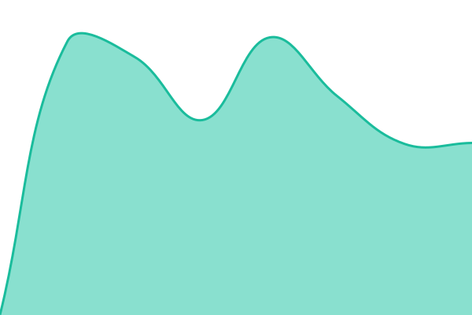

# [📈 Live Status](https://xmpl.dk/sit): <!--live status--> **🟩 All systems operational**

<!--start: status pages-->
<!-- This summary is generated by Upptime (https://github.com/upptime/upptime) -->
<!-- Do not edit this manually, your changes will be overwritten -->
<!-- prettier-ignore -->
| URL | Status | History | Response Time | Uptime |
| --- | ------ | ------- | ------------- | ------ |
|  VIA | 🟩 Up | [via.yml](https://github.com/briped/sit/commits/HEAD/history/via.yml) | 

 1254ms
     
 | 

<a href="https://xmpl.dk/history/via">98.32%</a>
    

|  SSP | 🟩 Up | [ssp.yml](https://github.com/briped/sit/commits/HEAD/history/ssp.yml) | 

 11733ms
     
 | 

<a href="https://xmpl.dk/history/ssp">98.31%</a>
    

|  SEG | 🟩 Up | [seg.yml](https://github.com/briped/sit/commits/HEAD/history/seg.yml) | 

 448ms
     
 | 

<a href="https://xmpl.dk/history/seg">98.32%</a>
    

|  ENS | 🟩 Up | [ens.yml](https://github.com/briped/sit/commits/HEAD/history/ens.yml) | 

 613ms
     
 | 

<a href="https://xmpl.dk/history/ens">98.33%</a>
    

|  UAG | 🟩 Up | [uag.yml](https://github.com/briped/sit/commits/HEAD/history/uag.yml) | 

 117ms
     
 | 

<a href="https://xmpl.dk/history/uag">95.70%</a>
    

<!--end: status pages-->

## 📄 License

- Powered by: [Upptime](https://github.com/upptime/upptime)
- Code: [MIT](./LICENSE) © [Anand Chowdhary](https://anandchowdhary.com)
- Data in the `./history` directory: [Open Database License](https://opendatacommons.org/licenses/odbl/1-0/)
