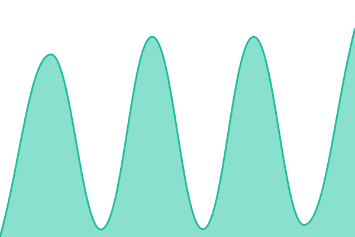
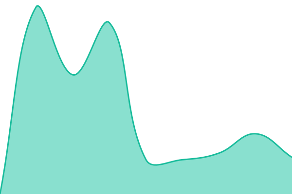
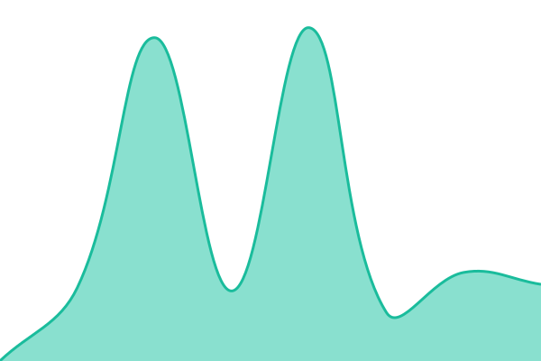

# [📈 Live Status](https://xmpl.dk/sit): <!--live status--> **🟩 All systems operational**

<!--start: status pages-->
<!-- This summary is generated by Upptime (https://github.com/upptime/upptime) -->
<!-- Do not edit this manually, your changes will be overwritten -->
<!-- prettier-ignore -->
| URL | Status | History | Response Time | Uptime |
| --- | ------ | ------- | ------------- | ------ |
|  WS1 Secure Email Gateway | 🟩 Up | [ws-1-secure-email-gateway.yml](https://github.com/briped/sit/commits/HEAD/history/ws-1-secure-email-gateway.yml) | 

 479ms
     
 | 

<a href="https://xmpl.dk/history/ws-1-secure-email-gateway">98.05%</a>
    

|  Exchange ActiveSync | 🟩 Up | [exchange-active-sync.yml](https://github.com/briped/sit/commits/HEAD/history/exchange-active-sync.yml) | 

 398ms
     
 | 

<a href="https://xmpl.dk/history/exchange-active-sync">98.06%</a>
    

|  WS1 Email Notification Service | 🟩 Up | [ws-1-email-notification-service.yml](https://github.com/briped/sit/commits/HEAD/history/ws-1-email-notification-service.yml) | 

 551ms
     
 | 

<a href="https://xmpl.dk/history/ws-1-email-notification-service">98.06%</a>
    

|  WS1 Unified Access Gateway Tunnel Service | 🟩 Up | [ws-1-unified-access-gateway-tunnel-service.yml](https://github.com/briped/sit/commits/HEAD/history/ws-1-unified-access-gateway-tunnel-service.yml) | 

 110ms
     
 | 

<a href="https://xmpl.dk/history/ws-1-unified-access-gateway-tunnel-service">98.08%</a>
    

|  WS1 Self-Service Portal | 🟩 Up | [ws-1-self-service-portal.yml](https://github.com/briped/sit/commits/HEAD/history/ws-1-self-service-portal.yml) | 

 13719ms
     
 | 

<a href="https://xmpl.dk/history/ws-1-self-service-portal">98.08%</a>
    

|  WS1 Content Gateway | 🟩 Up | [ws-1-content-gateway.yml](https://github.com/briped/sit/commits/HEAD/history/ws-1-content-gateway.yml) | 

 537ms
     
 | 

<a href="https://xmpl.dk/history/ws-1-content-gateway">98.09%</a>
    

|  WS1 Device Management | 🟩 Up | [ws-1-device-management.yml](https://github.com/briped/sit/commits/HEAD/history/ws-1-device-management.yml) | 

 418ms
     
 | 

<a href="https://xmpl.dk/history/ws-1-device-management">98.09%</a>
    

|  WS1 Device Services | 🟩 Up | [ws-1-device-services.yml](https://github.com/briped/sit/commits/HEAD/history/ws-1-device-services.yml) | 

 458ms
     
 | 

<a href="https://xmpl.dk/history/ws-1-device-services">98.10%</a>
    

|  WS1 Device Services Enrollment | 🟩 Up | [ws-1-device-services-enrollment.yml](https://github.com/briped/sit/commits/HEAD/history/ws-1-device-services-enrollment.yml) | 

 1281ms
     
 | 

<a href="https://xmpl.dk/history/ws-1-device-services-enrollment">98.10%</a>
    

|  WS1 App Catalog | 🟩 Up | [ws-1-app-catalog.yml](https://github.com/briped/sit/commits/HEAD/history/ws-1-app-catalog.yml) | 

 706ms
     
 | 

<a href="https://xmpl.dk/history/ws-1-app-catalog">98.11%</a>
    

|  VIA | 🟩 Up | [via.yml](https://github.com/briped/sit/commits/HEAD/history/via.yml) | 

 1139ms
     
 | 

<a href="https://xmpl.dk/history/via">98.11%</a>
    

|  LDV | 🟩 Up | [ldv.yml](https://github.com/briped/sit/commits/HEAD/history/ldv.yml) | 

 772ms
     
 | 

<a href="https://xmpl.dk/history/ldv">100.00%</a>
    

|  OWA | 🟩 Up | [owa.yml](https://github.com/briped/sit/commits/HEAD/history/owa.yml) | 

 1862ms
     
 | 

<a href="https://xmpl.dk/history/owa">98.12%</a>
    

<!--end: status pages-->

## 📄 License

- Powered by: [Upptime](https://github.com/upptime/upptime)
- Code: [MIT](./LICENSE) © [Anand Chowdhary](https://anandchowdhary.com)
- Data in the `./history` directory: [Open Database License](https://opendatacommons.org/licenses/odbl/1-0/)
