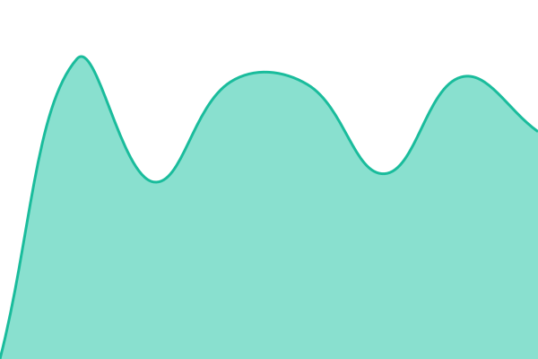

# [📈 Live Status](https://xmpl.dk/sit): <!--live status--> **🟧 Partial outage**

<!--start: status pages-->
<!-- This summary is generated by Upptime (https://github.com/upptime/upptime) -->
<!-- Do not edit this manually, your changes will be overwritten -->
<!-- prettier-ignore -->
| URL | Status | History | Response Time | Uptime |
| --- | ------ | ------- | ------------- | ------ |
|  VIA | 🟩 Up | [via.yml](https://github.com/briped/sit/commits/HEAD/history/via.yml) | 

 1310ms
     
 | 

<a href="https://xmpl.dk/history/via">99.28%</a>
    

|  LDV | 🟥 Down | [ldv.yml](https://github.com/briped/sit/commits/HEAD/history/ldv.yml) | 

 508ms
     
 | 

<a href="https://xmpl.dk/history/ldv">3.45%</a>
    

|  OWA | 🟩 Up | [owa.yml](https://github.com/briped/sit/commits/HEAD/history/owa.yml) | 

 2405ms
     
 | 

<a href="https://xmpl.dk/history/owa">100.00%</a>
    

|  SSP | 🟩 Up | [ssp.yml](https://github.com/briped/sit/commits/HEAD/history/ssp.yml) | 

 11220ms
     
 | 

<a href="https://xmpl.dk/history/ssp">99.27%</a>
    

|  SEG | 🟩 Up | [seg.yml](https://github.com/briped/sit/commits/HEAD/history/seg.yml) | 

 458ms
     
 | 

<a href="https://xmpl.dk/history/seg">99.27%</a>
    

|  ENS | 🟩 Up | [ens.yml](https://github.com/briped/sit/commits/HEAD/history/ens.yml) | 

 610ms
     
 | 

<a href="https://xmpl.dk/history/ens">99.28%</a>
    

|  UAG | 🟩 Up | [uag.yml](https://github.com/briped/sit/commits/HEAD/history/uag.yml) | 

 119ms
     
 | 

<a href="https://xmpl.dk/history/uag">98.14%</a>
    

<!--end: status pages-->

## 📄 License

- Powered by: [Upptime](https://github.com/upptime/upptime)
- Code: [MIT](./LICENSE) © [Anand Chowdhary](https://anandchowdhary.com)
- Data in the `./history` directory: [Open Database License](https://opendatacommons.org/licenses/odbl/1-0/)
